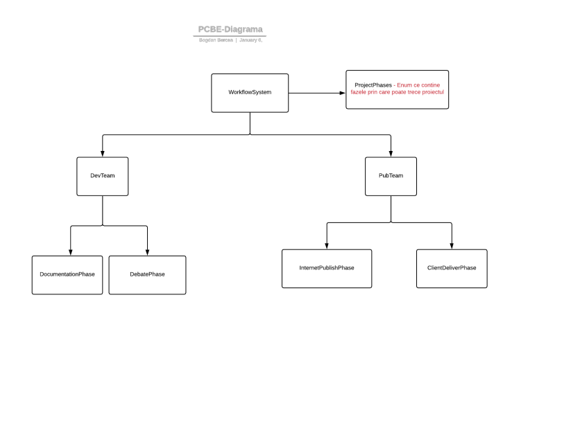

# Partea 1 - per echipa

## Membrii echipei
1. Bercea Bogdan
2. Bolovan Luigi-Ionut
3. Predut Liana-Miruna
4. Vilcu Isabella-Malina

## Specificatia functionalitatii proiectului - pe scurt
Titlul proiectului: **Workflow Simulator**

Proiectul simuleaza executia unor secvente de activitati dintr-o organizatie. 
Activitatiile sunt descrise ca o succesiune de stari legate prin tranzitii. 
Starile reprezinta activitati ce pot fi desfasurate in paralel.

## Descrierea arhitecturii software a sitemului, insotita de o diagrama de nivel inalt
Sistemul contine o echipa de Developeri ce va analiza documentatia si o echipa care se ocupa cu publicare documentatiei pe internet si trimiterea acesteia catre clienti. 

Echipa de developeri este responsabila cu realizarea documentatiei si a dezbaterii acesteia.
Trecerea de la o stare la alta se face secvential pe un singur thread creat de catre sistem la pornire.
Validarea documentatiei se face prin generarea unui numar subunitar random, iar atunci cand acesta este mai mare decat 0.75, documentatia va fi validata si echipa a doua va putea incepe publicarea documentatiei si trimiterea acesteia.

Echipa responsabila cu publicarea documentatiei isi desfasoara activitatea pe un thread separat, iar aceasta, la randul ei,
va executa simultan fazele de publicare pe internet si de tiparire si trimtere spre client pe alte doua threaduri.
Aceasta echipa va astepta ca echipa de developeri sa valideze documentatia aleasa si abia apoi va porni cele doua faze(threaduri).

Tranzitia starilor se realizaeaza prin verificarea starii actuale a sistemului. 
Spre exemplu, atunci cand sistemul se afla in starea de dezbateere a documentatiei si documentatia a fost validata, echipa responsabila cu publicarea isi va incepe activitatea.

